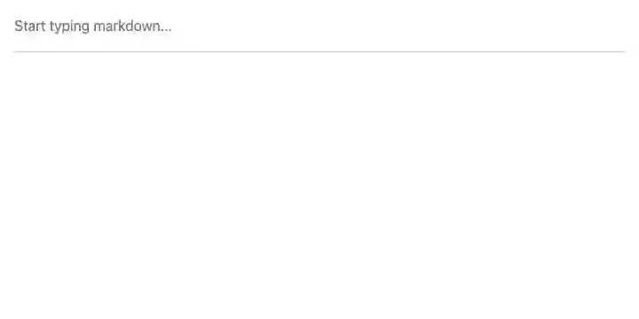

# live-md-editor

[](https://www.npmjs.com/package/live-md-editor)
[](https://github.com/salvatorecastellitti/live-md-editor/actions/workflows/ci.yml)
[](./LICENSE)

**Edit markdown without seeing markdown.** A lightweight WYSIWYG editor: headings look like
headings, checkboxes are real checkboxes, and the value you get back is plain markdown.
Built for AI: stream a model's answer in and it renders formatted as it arrives.
Works with Next.js, React, Vue, Svelte or no framework at all.




[Documentation](https://salvatorecastellitti.github.io/live-md-editor/) ·
[Playground](https://salvatorecastellitti.github.io/live-md-editor/playground) ·
[API](https://salvatorecastellitti.github.io/live-md-editor/api/)

## Features

- **Built for AI answers.** Stream markdown in from any model or SDK and it renders formatted
  as it arrives: unfinished syntax is repaired, so raw `**` or `###` never flash on screen. An AI
  can also write into a document at the cursor, as one undo step.
- **Code that looks right.** Optional syntax highlighting (languages load on demand) and a copy
  button on every code block.
- **Markdown in, markdown out.** The value is a plain string. Output is canonical, so saving
  never creates noisy diffs.
- **Formatted while you type.** `## ` becomes a heading, `- [ ] ` a checkbox, `**bold**` bold.
- **All of GFM:** headings, emphasis, strikethrough, links, images, nested lists, task lists,
  quotes, code blocks, rules and tables. Plus opt-in radio lists.
- **Headless.** No toolbar to fight: a small command API lets you build your own.
- **Safe.** Raw HTML is shown as text, never run. Links only allow http, https, mailto and
  relative URLs.
- **Fast.** About 2 ms per keystroke on a 10,000-line document.
- **Small.** 110.3 kB gzipped including ProseMirror (the engine behind many production editors).

## Install

```bash
npm install live-md-editor
```

## Next.js / React

```tsx
'use client'

import { useState } from 'react'
import { LiveMarkdownEditor } from 'live-md-editor/react'
import 'live-md-editor/style.css'

export function NoteEditor({ initial }: { initial: string }) {
  const [markdown, setMarkdown] = useState(initial)
  return <LiveMarkdownEditor value={markdown} onChange={setMarkdown} placeholder="Write..." />
}
```

## Streaming an AI answer

```tsx
import { LiveMarkdownEditor } from 'live-md-editor/react'
import { highlight } from 'live-md-editor/highlight'

// Pass the growing text and a streaming flag, as AI SDKs give them to you.
export function Answer({ answer, isStreaming }: { answer: string; isStreaming: boolean }) {
  return (
    <LiveMarkdownEditor
      value={answer}
      streaming={isStreaming}
      editable={!isStreaming}
      highlight={highlight}
    />
  )
}
```

```ts
// Or without React: stream any fetch body, SDK stream or async iterable.
const markdown = await editor.streamFrom(response.body!)
```

See the [AI streaming guide](https://salvatorecastellitti.github.io/live-md-editor/guide/ai),
including a Next.js route that streams Claude.

## Any framework, or none

```ts
import { createEditor } from 'live-md-editor'
import 'live-md-editor/style.css'

const editor = createEditor({
  element: document.querySelector('#editor')!,
  value: '# Hello\n\n- [ ] Try me',
  onChange: (markdown) => console.log(markdown),
})

editor.commands.toggleBold()
editor.isActive('bold')
editor.getMarkdown()
editor.destroy()
```

Guides for [Vue](https://salvatorecastellitti.github.io/live-md-editor/guide/vue),
[Svelte](https://salvatorecastellitti.github.io/live-md-editor/guide/svelte) and
[plain HTML](https://salvatorecastellitti.github.io/live-md-editor/guide/vanilla) are in the docs.

## Customise

- [Build a toolbar](https://salvatorecastellitti.github.io/live-md-editor/guide/toolbar) with
  `editor.commands` and `editor.isActive`.
- [Theme it](https://salvatorecastellitti.github.io/live-md-editor/guide/theming) with CSS
  variables such as `--lme-accent` and `--lme-font`. Dark mode is built in.
- [Large documents](https://salvatorecastellitti.github.io/live-md-editor/guide/performance):
  set `changeDelay` to batch `onChange`.

## Bundle size

| Entry                      | Gzipped                                                     |
| -------------------------- | ----------------------------------------------------------- |
| `live-md-editor`           | 110.3 kB                                                    |
| `live-md-editor/react`     | 110.7 kB (includes the core)                                |
| `live-md-editor/highlight` | 9.6 kB, plus 1 to 5 kB per language, loaded when first used |
| `live-md-editor/style.css` | 3.0 kB                                                      |

Sizes include every dependency and are checked on each pull request.

## Browser support

Current Chrome, Edge, Firefox and Safari, on desktop and mobile.

## Roadmap

Expo / React Native package, a math (LaTeX) add-on, image upload hooks, an optional toolbar
and slash menu, footnotes. Ideas welcome in
[issues](https://github.com/salvatorecastellitti/live-md-editor/issues).

## Contributing

See [CONTRIBUTING.md](./CONTRIBUTING.md).

## License

[MIT](./LICENSE)
